# BlogSpace Architecture Diagrams

## Current Architecture (Development)

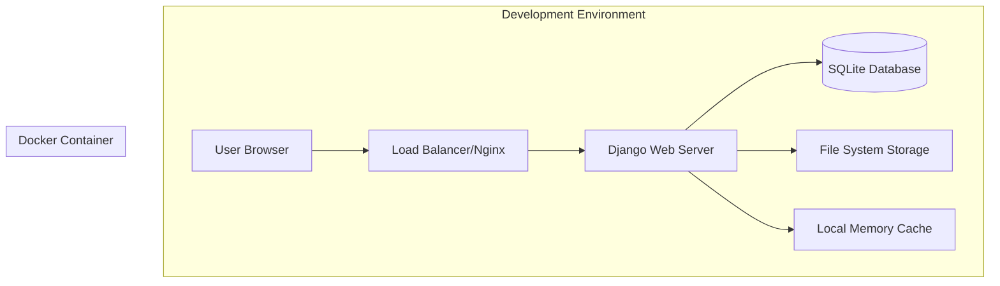

## Production Architecture (Current)

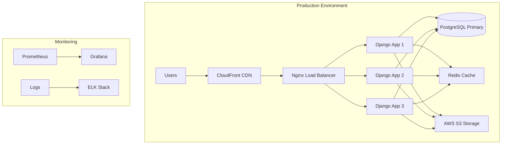

## Scalable Architecture (Future)

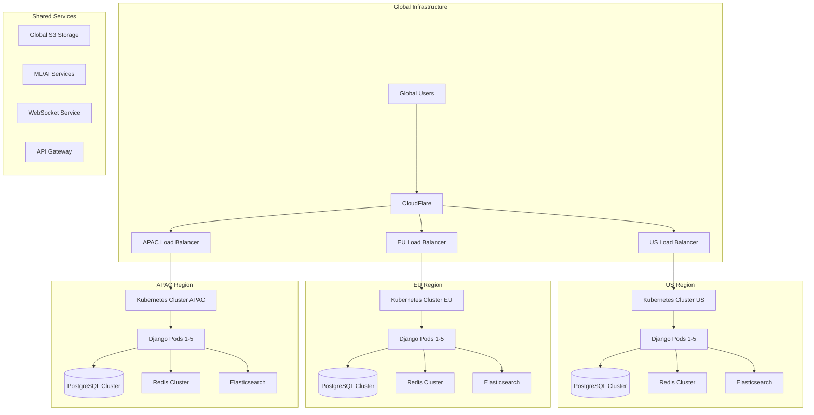

## Microservices Architecture (Long-term)

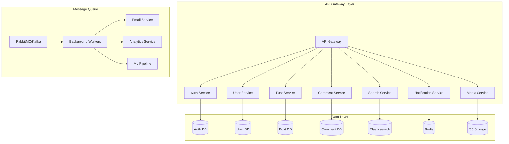

## Database Scaling Strategy

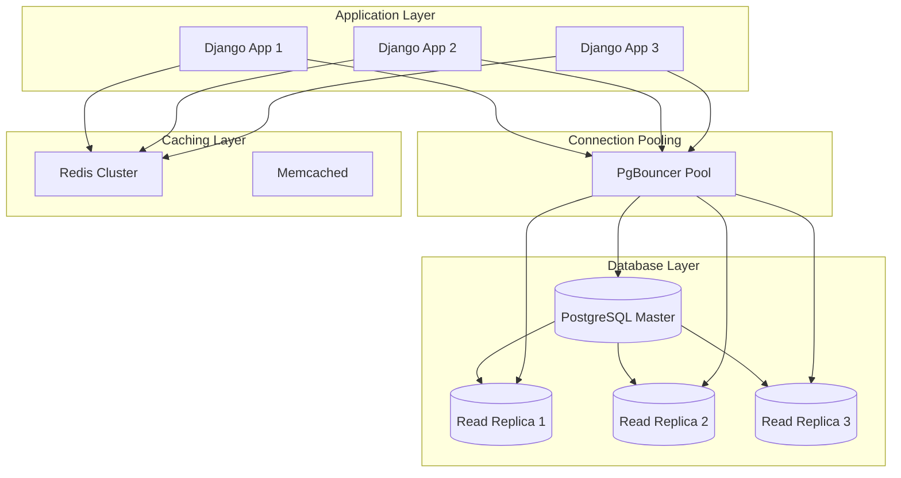

## Deployment Pipeline

```mermaid
graph LR
    subgraph "Development"
        DEV[Developer] --> GIT[Git Repository]
    end
    
    subgraph "CI/CD Pipeline"
        GIT --> CI[GitHub Actions]
        CI --> TEST[Run Tests]
        TEST --> BUILD[Build Docker Image]
        BUILD --> SCAN[Security Scan]
        SCAN --> PUSH[Push to Registry]
    end
    
    subgraph "Staging"
        PUSH --> STAGE[Staging Environment]
        STAGE --> QA[QA Testing]
    end
    
    subgraph "Production"
        QA --> PROD[Production Deployment]
        PROD --> MONITOR[Monitoring & Alerts]
    end
```

## Monitoring and Observability

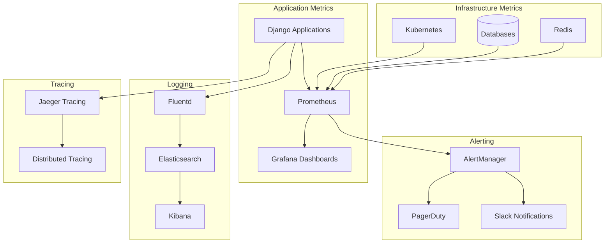

## Security Architecture

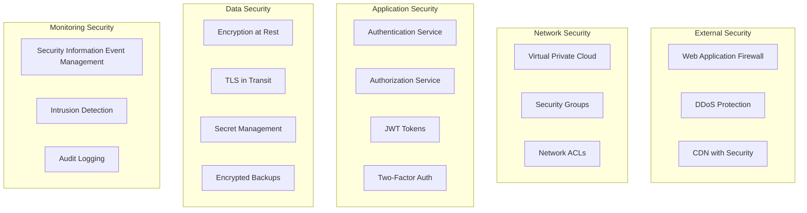

## Data Flow Architecture

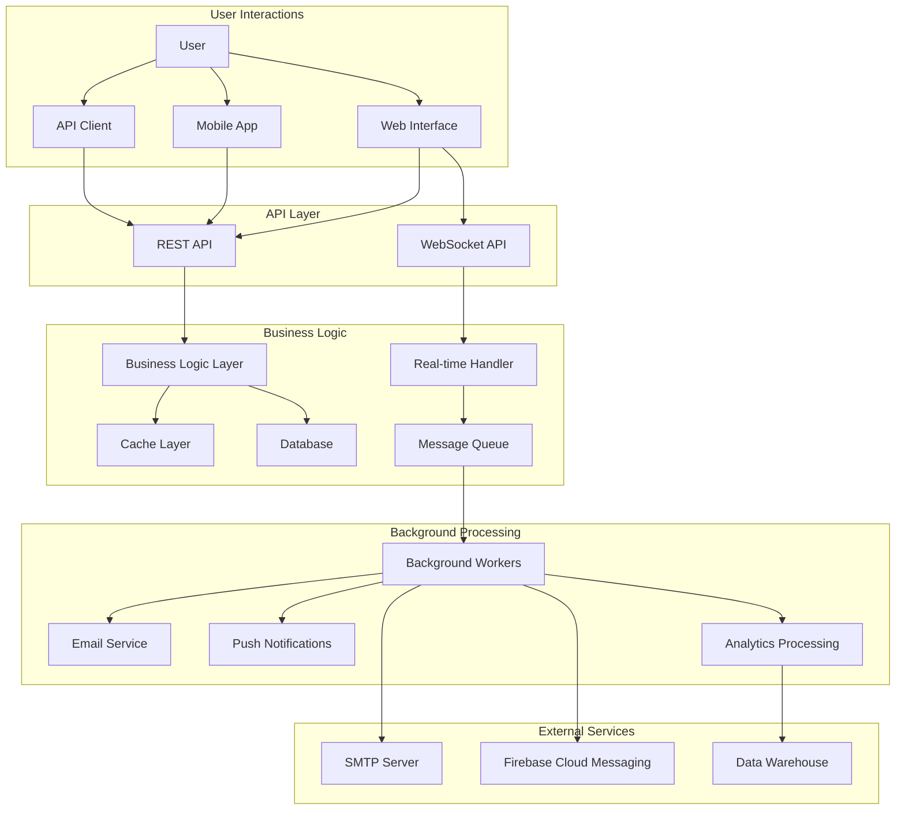

## Performance Optimization Strategy

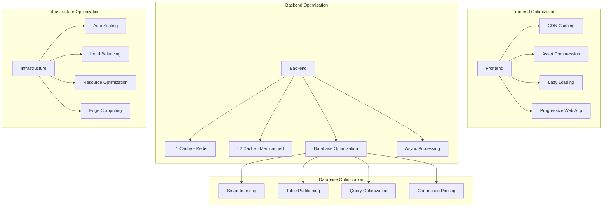

## Disaster Recovery Plan

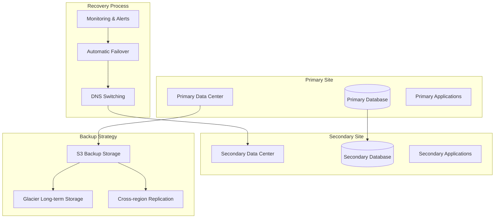

## Technology Evolution Roadmap

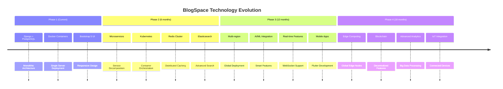

---

*These diagrams represent the architectural evolution of BlogSpace from a simple monolithic application to a globally distributed, microservices-based platform capable of serving millions of users.*
